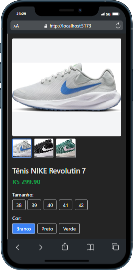
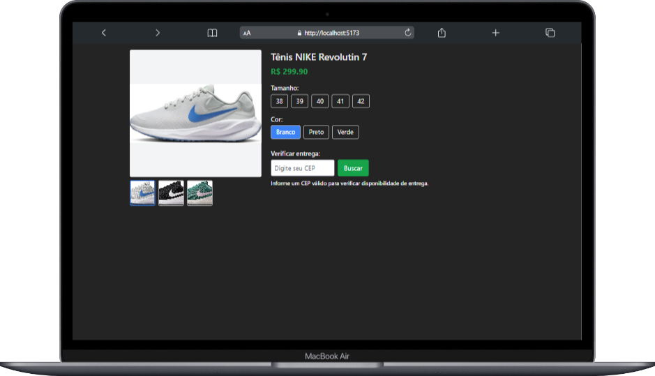

# Página de Produto E-commerce com React e Tailwind CSS

[👉 Veja o projeto online aqui](https://seu-dominio-ou-link-de-hospedagem.com)

## Descrição

Este projeto é uma página de produto para um e-commerce desenvolvida com React e Tailwind CSS. Ele apresenta imagens dinâmicas do produto, seleção de variantes (cor e tamanho), e uma funcionalidade para verificar a disponibilidade de entrega através do CEP, consultando a API ViaCEP.

O estado das seleções do usuário (cor, tamanho, imagem principal, CEP e endereço) é salvo localmente e mantido por 15 minutos, garantindo melhor experiência mesmo após atualizar a página.

### Principais funcionalidades

- Imagem principal do produto com miniaturas clicáveis para troca da imagem
- Seleção dinâmica de variantes: cor e tamanho
- Consulta de CEP com validação e exibição do endereço completo via API ViaCEP
- Persistência dos dados do usuário no localStorage por 15 minutos
- Interface responsiva com Tailwind CSS
- Acessibilidade web (WCAG) implementada: navegação por teclado, labels, roles ARIA, foco visível e mensagens dinâmicas para leitores de tela




## Como usar

### Pré-requisitos

- Node.js (versão 14+ recomendada)
- npm ou yarn instalado

### Instalação

1. Clone o repositório:

```bash
git clone https://github.com/seu-usuario/nome-do-repositorio.git
```

2. Entre na pasta do projeto:

```bash
cd nome-do-repositorio
```

3. Instale as dependências:

```bash
npm install
# ou
yarn
```

4. Inicie o servidor de desenvolvimento:

```bash
npm start
# ou
yarn start
```

5. Acesse a aplicação no navegador:

```
http://localhost:3000
```

---

## Estrutura do projeto

```
/src
  /assets
    nike_branco.jpg
    nike_preto.jpg
    nike_verde.jpg
  App.jsx
  index.js
  ...
tailwind.config.js
postcss.config.js
package.json
README.md
```

---

## Tecnologias utilizadas

- React
- Tailwind CSS
- API pública ViaCEP para consulta de CEP
- localStorage para persistência de dados no navegador

---

## Acessibilidade

O projeto foi desenvolvido seguindo as melhores práticas para acessibilidade, incluindo:

- Uso de tags semânticas (`main`, `section`, `fieldset`, `legend`)
- Labels associadas a inputs para leitores de tela
- Uso de `aria-pressed` para indicar estados selecionados em botões
- Navegação por teclado nas miniaturas de imagens e botões
- Mensagens dinâmicas com `aria-live` para atualização de informações
- Foco visível nas interações para melhor usabilidade

---

## Melhorias futuras

- Implementar mais variantes do produto (ex: diferentes modelos)
- Adicionar mensagens de erro mais detalhadas
- Integrar carrinho de compras e checkout
- Implementar testes automatizados (Jest, React Testing Library)
- Otimizar desempenho de imagens e lazy loading

---

## Licença

Este projeto está licenciado sob a licença MIT. Veja o arquivo [LICENSE](LICENSE) para mais detalhes.
